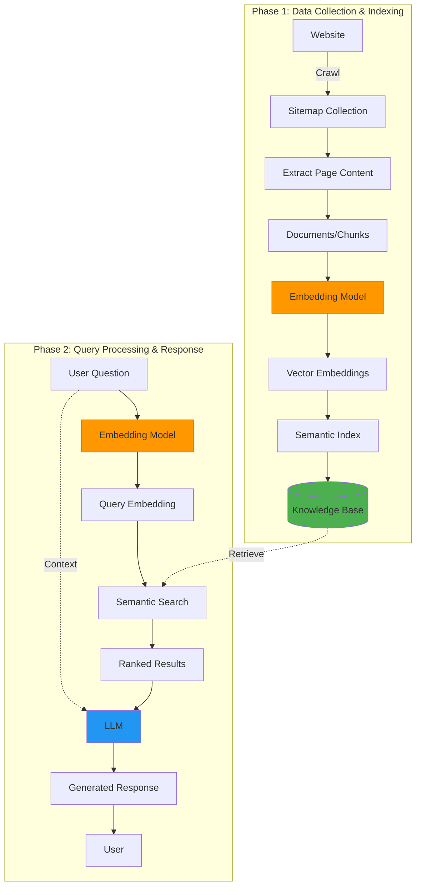

# Web_bot
A website chatbot powered by Retrieval Augmented Generation (RAG) architecture.

## Overview
This project implements an intelligent chatbot that can answer questions about any website's content by indexing the site's pages and using semantic search with LLM-powered responses.

## Project Architecture

## System Workflow

### Phase 1: Indexing (Data Ingestion)
1. **Sitemap Collection**: Crawl the target website and collect all URLs from sitemap
2. **Content Extraction**: Extract text content from each page
3. **Document Processing**: Convert pages into structured documents/chunks
4. **Embedding Generation**: Transform documents into vector embeddings using an embedding model
5. **Semantic Index**: Build a searchable semantic index from vectors
6. **Knowledge Base Storage**: Store embeddings and metadata in a vector database

### Phase 2: Query & Response (Runtime)
1. **User Question**: User submits a natural language question
2. **Query Embedding**: Convert the question into a vector embedding using the same embedding model
3. **Semantic Search**: Perform similarity search in the knowledge base
4. **Ranked Results**: Retrieve the most relevant document chunks
5. **LLM Response**: Feed ranked results + user question to LLM for answer generation
6. **Response Delivery**: Return the generated answer to the user

## Key Components

- **Sitemap Crawler**: Extracts all URLs from website sitemap
- **Embedding Model**: Converts text to vector representations (e.g., sentence-transformers, OpenAI embeddings)
- **Vector Database**: Stores and enables semantic search (e.g., FAISS, Pinecone, ChromaDB)
- **LLM**: Generates natural language responses (e.g., GPT, Claude, Llama)
- **Semantic Search Engine**: Finds relevant content based on query similarity

## Technologies (Planned)
- Python
- LangChain / LlamaIndex (RAG framework)
- Vector Database (FAISS/ChromaDB/Pinecone)
- Embedding Model (OpenAI/HuggingFace)
- LLM API (OpenAI/Anthropic/Local models)

## Getting Started
Coming soon...

## License
See LICENSE file for details.
